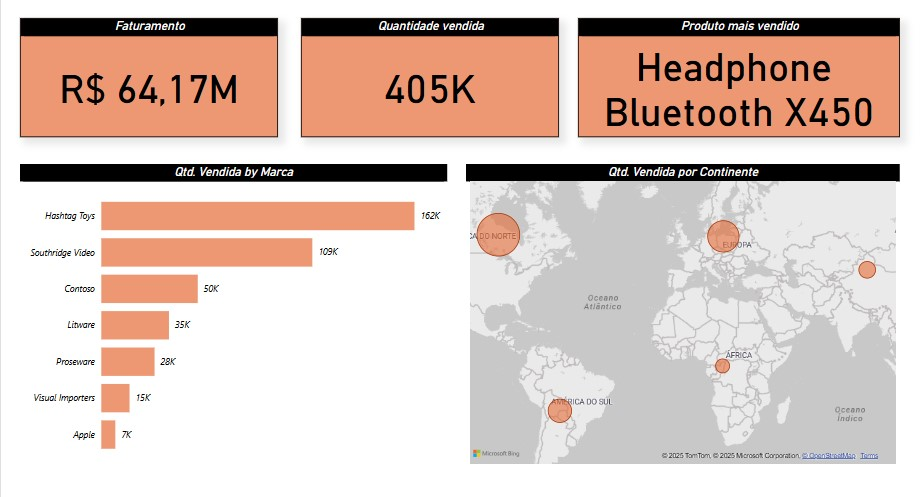

# 📊 Dashboard de Vendas - Power BI

## 🧠 Sobre o Projeto

Este projeto de dashboard de vendas foi desenvolvido com o objetivo de aprofundar meus conhecimentos em Power BI. Ele apresenta uma visão clara e interativa dos principais indicadores de desempenho em vendas, como faturamento total, quantidade vendida, produto mais vendido, além de análises por marca e por continente. O trabalho foi baseado na replicação de um projeto apresentado em um vídeo do Canal Hashtag Treinamentos [https://www.youtube.com/watch?v=cLwA7_hW8dA&list=PLQlQvFQvLm4qTXWLNIIc5-UleOWabjv5i&index=8](Link do vídeo), permitindo que eu praticasse diversos conceitos essenciais da ferramenta.

## 💼 O que foi feito

Durante o desenvolvimento do dashboard, explorei diferentes recursos do Power BI e enfrentei desafios práticos que me ajudaram a consolidar conhecimentos importantes. Dentre os principais aprendizados, destaco:

- **Filtros Dinâmicos:** Configurei filtros que permitem a seleção do produto mais vendido de forma automática e intuitiva.
- **Gráfico de Mapa:** Implementei um gráfico geográfico para visualizar a distribuição das vendas por continente, tornando a análise mais visual e contextual.
- **Interações Entre Gráficos:** Aprendi a controlar como os gráficos se comunicam entre si, criando uma experiência de análise mais fluida.
- **Interações Múltiplas:** Descobri como aplicar múltiplas interações entre diferentes visuais para análises mais profundas.

## 🧾 Resultados

O resultado é um painel intuitivo e visualmente atrativo, que permite acompanhar rapidamente os principais dados de desempenho em vendas. A experiência de replicar e adaptar esse projeto contribuiu significativamente para minha evolução no uso do Power BI e está agora disponível como parte do meu portfólio.

## 📌 Tecnologias Utilizadas

- Power BI Desktop  
- Microsoft Excel (para a base de dados)  
- Power Query  
- Visualizações nativas do Power BI  

## 📸 Dashboard

## 🚀 Próximos Passos

- Aplicar esses conhecimentos em projetos com dados reais.
- Integrar fontes externas de dados como bancos SQL e APIs.
- Avançar no uso de DAX e modelagem de dados mais complexa.

## 📬 Contato

Se quiser conversar sobre esse projeto ou outros assuntos relacionados a dados, fique à vontade para me chamar no [LinkedIn](#) ou por e-mail: **seuemail@exemplo.com**
